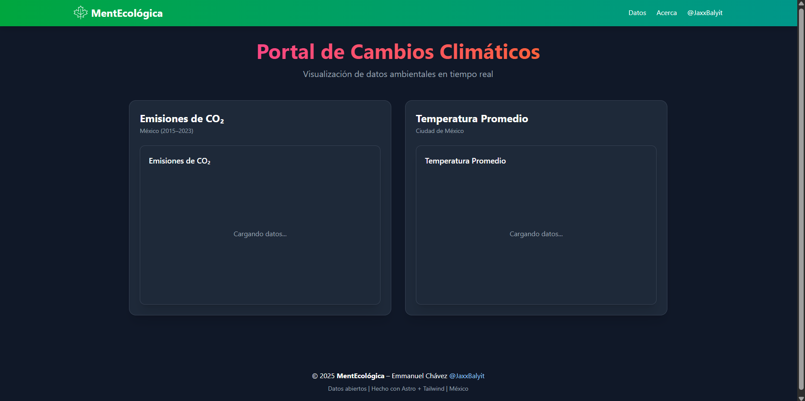

# Environmental Data Insights

**Visualización interactiva de datos ambientales en México** usando **Astro + Tailwind + Plotly.js**.



## Características
- Gráficos interactivos
- Datos reales (CSV)
- Diseño responsive
- Carga ultrarrápida

## Tecnologías
- [Astro](https://astro.build)
- [Tailwind CSS](https://tailwindcss.com)
- [Plotly.js](https://plotly.com/javascript/)
- [Python](https://www.python.org/)

## Instalación
```bash
  git clone https://github.com/JaxxBalyit/data_visualization_Astro-Python.git
```
Posteriormente, ejecutar:
```bash
  cd data_visualization_Astro-Python # o el nombre que le des
  npm install # o pnpm install
  npm run dev # o pnpm dev
```

## Autor
Emmanuel Chávez [@JaxxBalyit](https://github.com/JaxxBalyit) | México